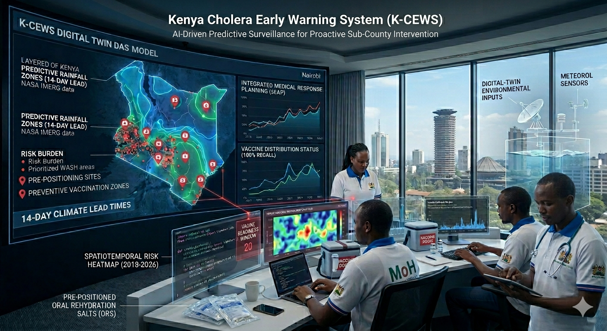

# 🇰🇪 Kenya Cholera Early Warning System (K-CEWS)
**PROMAX Edition: AI-Driven Predictive Surveillance & Logistics Command**



> *"In public health, time is the only currency that matters. A 24-hour delay in response can result in an exponential surge in infections; a 14-day head start can save a city."*

---

## Table of Contents

1. [Executive Summary & Problem Statement](#1-executive-summary--problem-statement)
2. [Project Innovation & Benchmarks](#2-project-innovation--benchmarks)
3. [Data Architecture & Sources](#3-data-architecture--sources)
4. [Machine Learning & Data Engineering Pipeline](#4-machine-learning--data-engineering-pipeline)
5. [The ProMax Command Center (Streamlit App)](#5-the-promax-command-center-streamlit-app)
6. [Project Success Metrics](#6-project-success-metrics)
7. [Ethical Considerations & Governance](#7-ethical-considerations--governance)
8. [Complete Project Structure](#8-complete-project-structure)
9. [Project Team](#9-project-team)

---

## 1. Executive Summary & Problem Statement
Explore the interactive outbreak trends via our Tableau Dashboard (https://public.tableau.com/authoring/K-CEWS/Dashboard1#1)
### The Current Failure: Reactive Surveillance

Currently, epidemiological surveillance in Kenya relies on the Integrated Disease Surveillance and Response (IDSR) framework. While robust for tracking, it suffers from three critical failures:

1.  **The Lag Gap:** Systems trigger only after patients arrive at clinics, creating a 10–14 day "Reactive Lag" between environmental contamination and public health response.

2.  **Resource Inefficiency:** Supplies are deployed after "Case Spikes," meaning resources often arrive *after* the peak of the transmission curve.

3.  **Data Silos:** Environmental data (NASA), health data (WHO), and demographic data (KNBS) exist in isolation, preventing a holistic understanding of risk.


### The K-CEWS Solution

K-CEWS utilizes spatiotemporal machine learning to bridge the gap between "Climate Shocks" and the biological transmission cycle of *Vibrio cholerae*. By implementing **Feature Lagging (t-14 days)**, K-CEWS acts as a "Sentinel" that looks 14 days into the future, empowering the Ministry of Health to pre-position Oral Cholera Vaccines (OCV) and medical supplies before an outbreak peaks.


---


## 2. Project Innovation & Benchmarks

K-CEWS addresses specific technical "Blind Spots" identified in regional and global frameworks:

* **vs. NASA-UNICEF Yemen Project:** Overcame the "War-Data Gap" by utilizing Kenya's highly stable KHIS/DHIS2 reporting systems for superior model verification.

* **vs. Ethiopia Infrastructure-Dependent Model:** K-CEWS is infrastructure-independent, leveraging NASA remote sensing to maintain 100% visibility even without physical sentinel sites.

* **vs. Kenya Red Cross sEAP Protocol:** Automates manual rain gauge checks using continuous API and satellite data feeds via an XGBoost engine.

* **vs. Nigeria ML Studies:** Introduces the crucial **14-Day Lead Time**, moving beyond predicting the *current* week to providing a true actionable foresight window.


---


## 3. Data Architecture & Sources

The system integrates four isolated data streams into a continuous geographic time-series dataset spanning a 10-year period (2015-2025):


| Data Stream | Source | Parameters | Strategic Importance |
| :--- | :--- | :--- | :--- |
| **Hydro-Climatic** | NASA POWER | IMERG Precipitation, T2M, RH2M | Identifies environmental "Outbreak Signatures." |
| **Socio-Demographic** | KNBS / Census | WASH %, Sanitation %, Risk Score | Weighs climate risk against human vulnerability. |
| **Geospatial** | HDX / OCHA | Admin Level 2 Boundaries | Enables high-resolution sub-county risk mapping. |
| **Epidemiological** | WHO / ReliefWeb| Clinical Case History (2015-2024) | Provides the "Ground Truth" for AI validation. |

---

## 4. Machine Learning & Data Engineering Pipeline
*(Located in `K-CEWS.ipynb`)*


The core intelligence evaluates high-risk reservoirs, particularly the **Lake Victoria Basin** (Kisumu, Migori, Homa Bay) and **Nairobi’s informal settlements**.


### Data Engineering

* **Temporal Shifting:** Weather variables (precipitation, humidity, temperature) are shifted forward by **14 days** (`shift(14)`) to align environmental triggers with biological incubation.

* **Rolling Windows:** Incorporates 14-day cumulative rainfall and average temperature.

* **Class Balancing (SMOTE):** Addresses the extreme rarity of outbreaks across the 10-year span by creating synthetic outbreak signatures for the training phase.


### Modeling Strategy

The system evaluates multiple algorithms to handle epidemiological overdispersion:

1.  **Negative Binomial Regression:** Establishes the baseline.

2.  **Random Forest Regressor/Classifier:** Evaluates non-linear relationships.

3.  **Optimized XGBoost (Production Engine):** Uses `scale_pos_weight=10` to heavily penalize the model for missing an outbreak, prioritizing **100% Outbreak Recall (Sensitivity)**.

4.  **Explainable AI (SHAP):** Transitions the model from a "Black Box" to a transparent tool, showing which variables drive risk scores.


---


## 5. The ProMax Command Center (Streamlit App)

*(Located in `app.py`)*

The Streamlit frontend is engineered as a high-availability dashboard for Sub-County Health Management Teams.

### Tableau Storytelling
Complementing the Streamlit app, the [Tableau Dashboard](https://public.tableau.com/authoring/K-CEWS/Dashboard1#1) provides interactive visuals for outbreak trends, climate drivers, and risk scores.


### Key Features:

* **Live Regional Risk Map:** Interactive Folium map dynamically color-coded by AI risk scores (Critical, Moderate, Low).

* **Medical Logistics Estimator:** An algorithmic calculator that uses baseline risk scores to generate a population proxy, then multiplies it by the live AI Risk Score to estimate required liters of Chlorine and ORS Kits.

* **14-Day Signature Trend:** Visualizes historical 14-day rainfall trends against predicted risk spikes.

* **Automated AI Memos:** Generates downloadable intelligence text reports for rapid sharing.

* **Data Engineering View:** Exposes model tournament results and variable distributions.


---


## 6. Project Success Metrics

K-CEWS is evaluated against the following benchmarks:

1.  **Statistical Sensitivity (Recall): 1.00 (100%)** - Calibrated to ensure zero missed outbreaks.

2.  **Operational Lead Time: 14 Days** - Minimum two-week warning window for logistics deployment.

3.  **AI Transparency:** Uses a **0.35 Probability Threshold** to flag risks that traditional methods ignore.

4.  **Operational Latency:** Ingests new satellite data and updates forecasts within a 5-minute window.


---


## 7. Ethical Considerations & Governance

K-CEWS adheres strictly to the **Data Protection Act (2019) of Kenya**:

* **De-identification:** Operates entirely at the Sub-County aggregate level. No individual patient "Line Lists" or GPS coordinates are ingested.

* **Equity:** Incorporates KNBS socio-demographic baselines so that low-reporting rural areas are not "hidden" from the AI.


---


## 8. Complete Project Structure


```text

Kenya_Cholera_Early_Warning_System/
│
├── app.py                              # Streamlit Command Center Application
├── K-CEWS.ipynb                        # Master Data Engineering & ML Pipeline
├── requirements.txt                    # Python dependencies
├── README.md                           # Project documentation
├── .gitignore                          # Git ignore rules
│
├── Image/
│   └── coverImg.png                    # Dashboard/Project cover imagery
│
└── csv/                                # Comprehensive Data Repository
    ├── full_geotemporal_dataset.csv    # Final engineered dataset (Notebook output)
    ├── kcews_live_predictions.csv      # Main prediction outputs driving Streamlit app
    ├── ken_admin2.geojson              # Spatial mapping data for Folium
    ├── model_performance_comparison.csv# Algorithm tournament evaluation metrics
    ├── subcounty_risk_factors.csv      # KNBS Baseline WASH/Epi risk scores
    ├── historical_test_dataset.csv     # Historical baseline for evaluation
    ├── stakeholder_summary.csv         # High-level data for stakeholder reporting
    ├── NASA_Weather_Master.csv         # Consolidated historical weather data
    ├── Train_*_raw.csv                 # Raw training data sets (Nairobi, Migori, Kisumu)
    ├── Test_*.csv                      # Isolated testing data sets
    └── live_*.csv                      # Live/Recent data feeds

```

---

## 9. project-team

**Role & Core Responsibility**

* **Abel Aleu Chol Garang** - Project Lead & UI Developer|"Project architecture, Streamlit deployment, UI/UX logic."

* **Augustine Magani** - Technical Researcher,"Data sourcing, literature review, technical documentation."

* **Patience Chepkosgei** - Data Analyst,Exploratory Data Analysis (EDA) and Tableau Storytelling.

* **Carolyne Githenduka** - Data Engineer,"ETL processes, data cleaning, 14-day feature lagging."

* **Marcus Kaula** - Machine Learning Engineer,"Lead modeler (Negative Binomial, Random Forest, XGBoost)."
